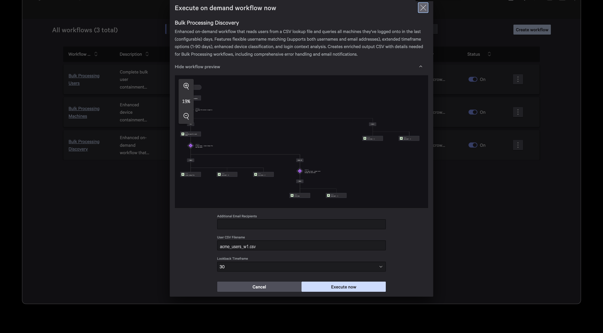
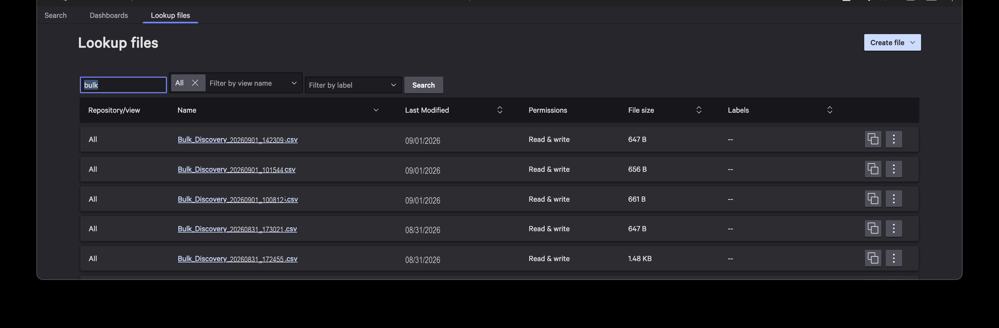
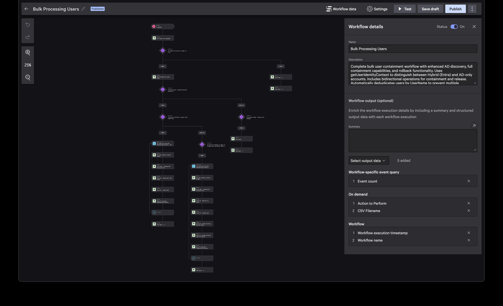
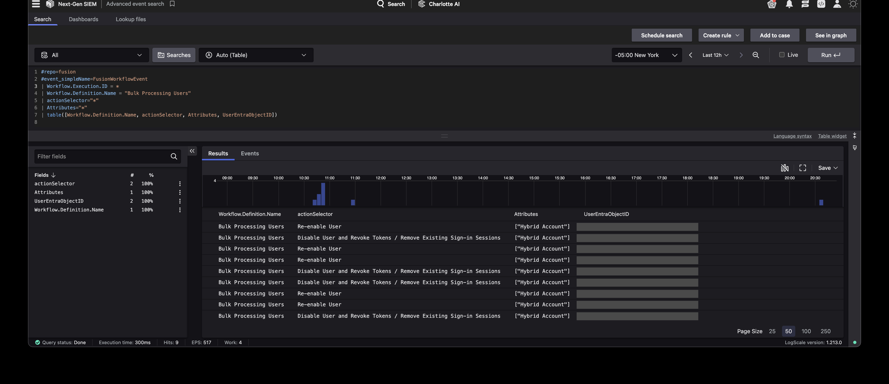
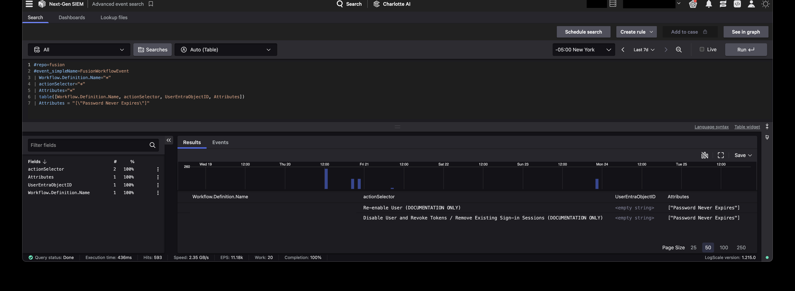

## Overview

This guide provides step-by-step instructions for the SOC team to use the three CrowdStrike Fusion workflows for bulk user and device containment operations during security incidents.

**The workflows work together in sequence:**
1. **Bulk Processing Discovery** - Find all devices where compromised users have logged in
2. **Bulk Processing Machines** - Contain or release those devices
3. **Bulk Processing Users** - Disable or re-enable the user accounts

**Note on naming:** conference and briefing material may refer to these by shorter names. The names below are what you will actually see in the Fusion SOAR workflow list, and are what you should search for.

| Referred to as | Deployed workflow name |
|----------------|------------------------|
| Bulk Discovery | `Bulk Processing Discovery` |
| Bulk Device Containment | `Bulk Processing Machines` |
| Bulk User Containment | `Bulk Processing Users` |

---

## Workflow 1: Bulk Processing Discovery

### What it does
Takes a list of usernames and finds all the computers they've logged into recently. Generates a CSV file that the other workflows will use.

### When to use it
- Start of incident response when you have a list of compromised usernames
- Need to find all devices potentially affected by compromised accounts
- Before running bulk containment operations

### Step-by-Step Instructions

#### Step 1: Prepare and upload your input CSV file
1. Create a CSV file with the header exactly as `UserName` (case-sensitive)
2. Add one username per row. **Any format is accepted**, and you can mix formats in the same file:

| Format | Example |
|--------|---------|
| Full email | `jordan.reyes@acme.com` |
| First.Last (bare) | `jordan.reyes` |
| SAM account name | `jreyes` |
| Domain-prefixed SAM | `ACME\jreyes` |

   The workflow automatically normalizes all formats, resolves them via sensor telemetry and IDP, and deduplicates before running the search.

3. Upload the CSV to the NG-SIEM Lookup Files:
   - Navigate to **Next-Gen SIEM → Advanced Event Search → Lookup Files**
   - Click **Upload** and select your CSV file
   - Note the exact filename; you will need it in Step 2
4. Verify your file appears in the Lookup Files list

**Example CSV content:**
```
UserName
jordan.reyes@acme.com
jreyes
ACME\mkendrick
morgan.kendrick
```

#### Step 2: Run the Discovery Workflow
1. Navigate to **CrowdStrike Falcon → Fusion SOAR → Workflows**
2. Find **"Bulk Processing Discovery"** in the workflow list
3. Click the **kebab/snowman menu** (⋮) on the workflow row, then select **"Execute"**
4. Fill in the parameters:
   - **CSV Filename**: Enter the exact filename you uploaded in Step 1 (e.g., `acme_users_w1.csv`)
   - **Lookback Timeframe**: How many days back to search for user logon activity (1 to 90 days, default: 30)
   - **Additional Email Recipients**: Optional. Results automatically go to you and the SOC team
5. Click **"Execute now"** 

> **Warning:** The CSV Filename field is sensitive to leading and trailing spaces. If you copy-paste the filename from the Falcon UI, check for extra whitespace; the workflow will fail if spaces are present. See Troubleshooting for details.

#### Step 3: Monitor and Review Results
1. The workflow will email you when complete or you may click "View" to see the execution in real-time
2. **If successful**: You'll receive an email with a CSV attachment containing all user-device combinations
3. **If no data found**: You'll get troubleshooting suggestions (try longer timeframe, verify usernames)
4. **If file not found**: Check that your CSV file was uploaded correctly

### To locate the CSV Lookup file (name needed for other workflows)
1. Navigate to Next-Gen SIEM | Lookup files
2. Search `bulk` and note files beginning with `Bulk_Discovery_` and a timestamp (`YYYYMMDD_HHMMSS.csv`) 
#### What you get back
The output CSV contains these columns:
- `DeviceType`: Type of device (Workstation, Server, etc.)
- `ComputerName`: Name of the computer/device
- `aid`: CrowdStrike Agent ID (needed for containment)
- `UserName`: The username that logged in
- `UPN`: User's email/principal name
- `LogonDomain`: Domain Logged Onto
- `latest_login_time`: When they last logged in
- `LoginContext`: How they logged in (Interactive, Network, etc.)
- `event_platform`: Win, Mac, Lin

### Additional Output: Unresolved Users

Every Discovery execution also produces an **unresolved users file** (`bulk_unresolved_<ExecutionID>.csv`) in the NG-SIEM Lookup Files. This file lists any usernames that could not be resolved through sensor telemetry or IDP lookup, for example SAM account names that are not in Entra, or stale accounts. Review this file to identify users that may need manual follow-up.

---

## Workflow 2: Bulk Processing Machines

### What it does
Takes the CSV file from Discovery workflow and contains (or releases) all the workstation devices. **Servers are automatically excluded for safety.**

### When to use it
- After running Discovery workflow and getting the results CSV
- Need to quickly contain multiple compromised workstations
- Need to release devices after incident resolution

### Step-by-Step Instructions

#### Step 1: Locate the Discovery CSV
1. Navigate to **Next-Gen SIEM → Advanced Event Search → Lookup Files**
2. Search for `Bulk_Discovery_`. The most recent file will have a timestamp in the format `YYYYMMDD_HHMMSS.csv` (see the Lookup files screenshot in Workflow 1)
3. **Verify you have the correct file**. Confirm the timestamp matches the Discovery workflow execution you just ran. Using the wrong lookup file could contain/release the wrong devices.
4. Copy the exact filename (be careful of leading/trailing spaces; see Troubleshooting)

> **Tip:** If you cannot find the file, go to **Advanced Event Search**, run the query `#repo=search-all | table([@rawstring])` filtered for recent lookup files, or re-run the Discovery workflow and check the results email for the output filename.

#### Step 2: Choose Your Action
**For Containment (during active incident):**
- Use "Contain Devices" to isolate compromised workstations
- This prevents lateral movement and data exfiltration

**For Release (after incident resolved):**
- Use "Release from Containment" to restore normal operations
- Only do this after confirming devices are clean

#### Step 3: Run the Machines Workflow
1. Navigate to **CrowdStrike Falcon → Fusion SOAR → Workflows**
2. Find **"Bulk Processing Machines"** in the workflow list
3. Click the **kebab/snowman menu** (⋮) on the workflow row, then select **"Execute"**
4. Fill in the parameters:
   - **CSV Filename**: Enter the Discovery CSV filename from Step 1 (e.g., `Bulk_Discovery_YYYYMMDD_HHMMSS.csv`)
   - **Action to Perform**: Choose "Contain Devices" or "Release from Containment"
   - **Additional Email Recipients**: You and SOC team will already receive emails; only enter additional emails if needed
5. Click **"Execute now"**

> **Warning:** The CSV Filename field is sensitive to leading and trailing spaces. The workflow will not complete if extra whitespace is present. See Troubleshooting for details.

#### Step 4: Monitor Results
1. The workflow will email you when complete
2. Email shows how many devices were processed
3. Includes a copy of the device list as CSV attachment

#### Important Safety Notes
- **Only workstations are processed** - servers are automatically skipped for safety
- Can process up to 500 devices at once
- Operations run simultaneously for faster response
- If some devices fail, the workflow continues with the rest

### Verify Containment Status
After running the workflow, verify device status:
1. Go to **Falcon Console > Host Management**
2. Search for specific devices by hostname
3. Check the **Status** column:
   - **"contained"** = Successfully contained
   - **"containment_pending"** = Containment in progress
   - **"normal"** = Not contained (or successfully released)

---

## Workflow 3: Bulk Processing Users

### What it does
Takes the CSV file from Discovery workflow and disables (or re-enables) the user accounts and other related actions (add user to emergency block group, revoke existing refresh tokens, revoke existing sign-in sessions). Automatically detects account types and handles cloud (Entra ID); and on-premises (AD) accounts need to be processed separately.

### When to use it
- After running Discovery workflow and getting the results CSV
- Need to quickly disable multiple compromised user accounts
- Need to re-enable users after incident resolution and password resets

### Step-by-Step Instructions

#### Step 1: Locate the Discovery CSV
1. Navigate to **Next-Gen SIEM → Advanced Event Search → Lookup Files**
2. Search for `Bulk_Discovery_` and find the file with the timestamp matching your Discovery run
3. **Verify you have the correct file**. Confirm the timestamp matches the Discovery execution. Using the wrong lookup file could disable/enable the wrong users.
4. Copy the exact filename (be careful of leading/trailing spaces; see Troubleshooting)

#### Step 2: Run the Users Workflow
1. Navigate to **CrowdStrike Falcon → Fusion SOAR → Workflows**
2. Find **"Bulk Processing Users"** in the workflow list
3. Click the **kebab/snowman menu** (⋮) on the workflow row, then select **"Execute"**
4. Fill in the parameters:
   - **Action to Perform**: Choose your disable/enable action
   - **Additional Email Recipients**: optional
   - **CSV Filename**: Enter the Discovery CSV filename from Step 1 (e.g., `Bulk_Discovery_YYYYMMDD_HHMMSS.csv`)
5. Click **"Execute now"**

> **Warning:** The CSV Filename field is sensitive to leading and trailing spaces. The workflow will not complete if extra whitespace is present. See Troubleshooting for details.

#### Step 3: Monitor Results
1. The workflow will email you when complete
2. To monitor in real time: click **"View"** on the workflow execution to see the execution details panel
   - The workflow processes each user in a loop, so you can track progress by watching the **loop iteration count** and the status of each action within the loop (Completed, In Progress, Skipped)
   - Each iteration shows the individual user being processed and whether their Entra lookup, disable/enable, token revocation, and session revocation succeeded or were skipped
3. When finished, the results email shows how many users were processed
4. Email includes a copy of the user list as CSV attachment
5. Email contains a query link for checking account types processed

### What Happens During Containment


The workflow automatically handles Entra/Hybrid account types:

**For Cloud-Synced Accounts (Entra ID):**
- Adds user to security group (Emergency-Block-List)
- Disables the account in Azure AD
- Revokes all refresh tokens
- Terminates existing sign-in sessions

**For On-Premises Only Accounts:**
- **Manual action required**

### Important Notes
- **Duplicate users are automatically removed** - if same user appears multiple times (logged onto multiple machines), only processed once
- Can process up to 500 users at once
- Operations run simultaneously for faster response
- All actions are logged for audit purposes

### Verify User Status (Validation)
After running the workflow, verify user status:
1. Go to **Azure AD Portal > Users** (for cloud accounts)
2. Search for user by email/username
3. Check:
   - Account enabled/disabled status
   - Group memberships
   - Sign-in logs for session termination

### Account Type Information
To review workflow via Advanced event search:
```
#repo=fusion | Workflow.Execution.ID = 00000000000000000000000000000000
```
(Replace `00000000000000000000000000000000` with the actual execution ID from the workflow results email)
Note the Workflow execution ID at the end of the email

To see what type of accounts were processed and the actions performed, use this Advanced Event Search query after the workflow completes:
```sql
#repo=fusion
#event_simpleName=FusionWorkflowEvent
| Workflow.Definition.Name = "Bulk Processing Users"
| actionSelector="*"
| Attributes="*"
| table([Workflow.Definition.Name, actionSelector, Attributes, UserEntraObjectID])
```


Here's an example of what a non-Entra/Hybrid account might look like (note the `UserEntraObjectID` is an <empty string> and `Attributes` does not contain `["Hybrid Account"])


---

## Quick Reference - Typical Incident Response Workflow

### During Active Incident
1. **Prepare compromised user list** - Create CSV with one username per row
2. **Run Discovery** - Find all devices where these users logged in
3. **Contain Devices** - Use Machines workflow to isolate workstations
4. **Contain Users** - Use Users workflow to disable accounts and kill sessions

### After Incident Resolved
1. **Reset Passwords** - Ensure all compromised accounts have new passwords
2. **Release Users** - Use Users workflow to re-enable accounts
3. **Release Devices** - Use Machines workflow to lift containment
4. **Monitor** - Watch for any suspicious activity resuming

---

## Troubleshooting

### Discovery Workflow Issues
**"No data found"**
- Try extending the timeframe (e.g., from 30 to 60 days)
- Verify usernames in your CSV are correct
- Check if users have actually logged in recently

**"File not found"**
- Ensure your CSV is uploaded to the search-all repository
- Check filename spelling exactly matches what you entered

### Machines Workflow Issues
**"No devices found"**
- Verify your CSV came from Discovery workflow
- Check that CSV contains workstation entries
- Ensure devices have valid CrowdStrike Agent IDs

### Users Workflow Issues
**"No users found"**
- Verify CSV contains UPN and UserName columns
- Check that these fields are populated in the CSV
- Confirm CSV came from Discovery workflow

### CSV Filename and Whitespace Issues
**Workflow fails immediately or returns "File not found" despite correct filename**
- The CSV Filename field in all three workflows is sensitive to **leading and trailing spaces**. Even one extra space will cause the workflow to fail.
- **Falcon UI paste bug:** When you copy a lookup filename from the Falcon UI (e.g., from the Lookup Files list), the clipboard may include a **leading newline character** that is invisible in the text field. This will cause the workflow to fail silently.
- **Workaround:** Type the filename manually, or paste into a plain text editor first (e.g., Notepad) to strip invisible characters, then copy from there into the workflow parameter.

---

## Contact Information

- **Email Notifications**: Automatically sent to workflow executor and SOC team (note these are individual emails hardcoded into the workflow instead of a distribution list due to internal email security controls)
- **Workflow Support**: Contact SOC team lead for workflow issues
- **Technical Issues**: Contact CrowdStrike for platform problems

---

## Important Safety Reminders

1. **Server Protection**: Machine workflow automatically excludes servers - no containment operations will be performed
2. **Test First**: If unsure, test with a small group of users/devices first or designated test objects
3. **Coordinate**: Inform relevant teams before mass containment operations
4. **Document**: Keep records of what was done for incident reporting
5. **Verify**: Always check that containment/release worked as expected

Remember: These workflows are powerful tools for incident response. Use them responsibly and follow your organization's incident response procedures.